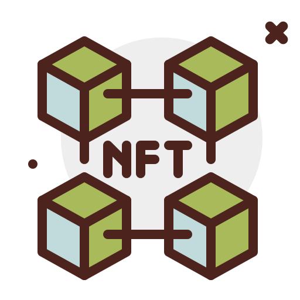

# BlockchainUNN

## Table of contents

- [Overview](#overview)
  - [Screenshot](#screenshot)
  - [Links](#links)
  - [Built with](#built-with)
  - [What I learned](#what-i-learned)
  - [Continued development](#continued-development)
- [Author](#author)
- [Acknowledgments](#acknowledgments)


## Overview
This is a task from BlockchainUNN community to we the developers to create a website for the community here in Enugu Nigeria so our craft get sharpened day by day.


### Screenshot


### Links

- Live Site URL:(https://peterforyou.github.io/BlockchainUnn_web/)


### Built with

- Semantic HTML5 markup
- CSS custom properties
- Flexbox
- CSS Grid

### What I learned

I learnt how to use css grid especially the repeat attribute, see beloe


```html
   <div class="nft">
            <div>
                
                <p>NFT</p>
            </div>
```
```css
 #what .nft {
    margin: auto;
    max-width: 900px;
    display: grid;
    grid-template-columns: repeat(4, 1fr);
    grid-gap: 20px 50px;
}
```
### Continued development    

I would love focusing more on Css animation since i discoovered am lacking more in that area.

## Author

- Name -(Peter Bit)
- Frontend Mentor -(https://www.frontendmentor.io/profile/yourusername)
- Twitter - (https://www.twitter.com/@Peterbyte2/)

## Acknowledgments

Am giving accolades to my dear self for writing this code up, it wasn't a difficult one but i still acknowledge BlockchainUNN cOmmunity for this beautiful and educative task. Its an eye opener.